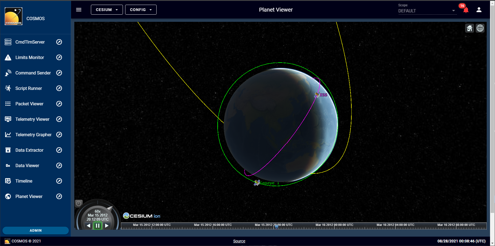

# cosmosc2-tool-planetviewer

This plugin provides the Cosmos v5 with an integrated Cesium viewer. The user can visualize data on the globe in realtime or rewatch a time with data pulled from Cosmos. The user can also load czml files and add static points or dynamic points.

[Documentation](http://cosmosrb.com)



## Building

```
> yarn
...
> yarn build
...
> rake build VERSION=5.0.X
```